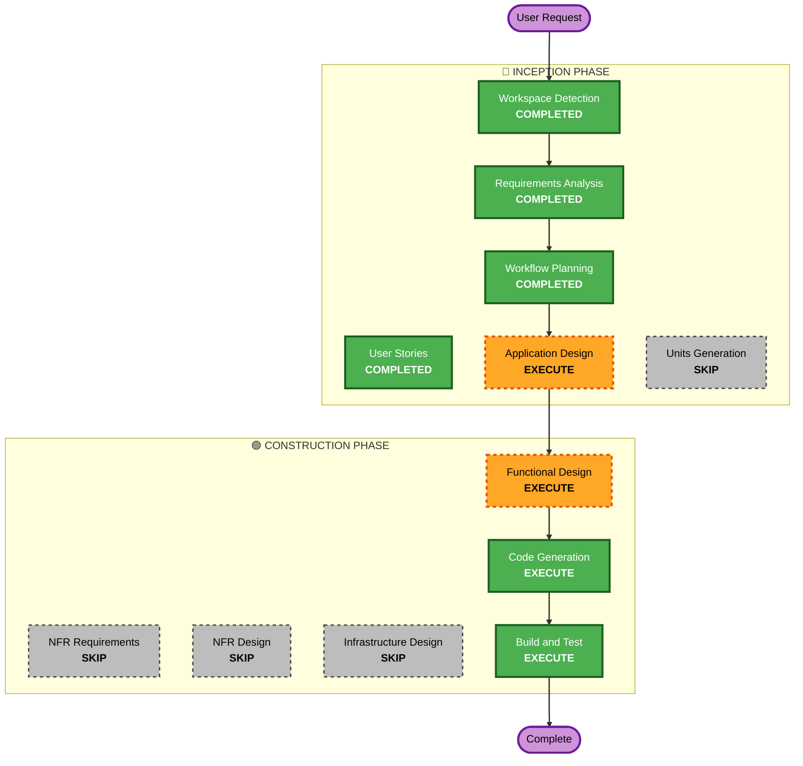

# Execution Plan — Team Knowledge Base

## Detailed Analysis Summary

### Change Impact Assessment
- **User-facing changes**: Yes — entire application is user-facing (sign-in, authoring, editing, search, tagging, stale flagging)
- **Structural changes**: Yes — new greenfield application with multiple layers (API routes, templates, database models)
- **Data model changes**: Yes — new SQLite schema with 5 entities (User, Article, Tag, ArticleTag, EditLog)
- **API changes**: N/A — greenfield, no existing APIs
- **NFR impact**: Minimal — local-only deployment, trust-based auth, no performance constraints

### Risk Assessment
- **Risk Level**: Low — greenfield project, well-understood CRUD patterns, local-only deployment
- **Rollback Complexity**: Easy — no production systems affected
- **Testing Complexity**: Simple — standard unit/integration tests

---

## Workflow Visualization



### Text Alternative
```
Phase 1: INCEPTION
  - Workspace Detection (COMPLETED)
  - Requirements Analysis (COMPLETED)
  - User Stories (COMPLETED)
  - Workflow Planning (COMPLETED)
  - Application Design (EXECUTE)
  - Units Generation (SKIP)

Phase 2: CONSTRUCTION
  - Functional Design (EXECUTE)
  - NFR Requirements (SKIP)
  - NFR Design (SKIP)
  - Infrastructure Design (SKIP)
  - Code Generation (EXECUTE)
  - Build and Test (EXECUTE)

Phase 3: OPERATIONS
  - Operations (PLACEHOLDER)
```

---

## Phases to Execute

### 🔵 INCEPTION PHASE
- [x] Workspace Detection (COMPLETED)
- [x] Requirements Analysis (COMPLETED)
- [x] User Stories (COMPLETED — 14 stories, 1 persona)
- [x] Workflow Planning (COMPLETED)
- [ ] Application Design - **EXECUTE**
  - **Rationale**: New application needs component/service definitions, route structure, and template layout planning before code generation
- [x] Units Generation - **SKIP**
  - **Rationale**: Single application unit — no need to decompose into multiple units of work

### 🟢 CONSTRUCTION PHASE (Single Unit)
- [ ] Functional Design - **EXECUTE**
  - **Rationale**: Data models, business rules (stale flagging, edit logging, tag management), and API route contracts need detailed design before coding
- [x] NFR Requirements - **SKIP**
  - **Rationale**: No performance, security, or scalability constraints beyond defaults; local-only deployment; security extension disabled
- [x] NFR Design - **SKIP**
  - **Rationale**: NFR Requirements skipped, no NFR patterns to incorporate
- [x] Infrastructure Design - **SKIP**
  - **Rationale**: Local development only, no cloud/container infrastructure needed
- [ ] Code Generation - **EXECUTE** (ALWAYS)
  - **Rationale**: Full application code generation — FastAPI routes, SQLAlchemy/SQLite models, Jinja2 templates, HTMX interactions
- [ ] Build and Test - **EXECUTE** (ALWAYS)
  - **Rationale**: Build instructions, dependency setup, unit tests, integration tests

### 🟡 OPERATIONS PHASE
- [ ] Operations - PLACEHOLDER

---

## Success Criteria
- **Primary Goal**: Working team knowledge base accessible at localhost
- **Key Deliverables**: FastAPI application with HTMX frontend, SQLite database, full CRUD for articles with tagging, search, and stale flagging
- **Quality Gates**: Application runs locally, all routes functional, search + tag filtering works, stale banner displays correctly
