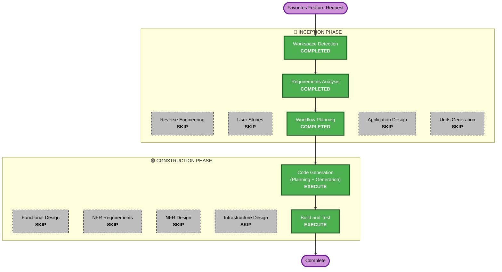

# Execution Plan — Favorites Feature

## Detailed Analysis Summary

### Transformation Scope
- **Transformation Type**: Single feature addition across existing components
- **Primary Changes**: New Favorite model, new service, new route, template updates
- **Related Components**: Models, Services, Routes, Templates, Schemas

### Change Impact Assessment
- **User-facing changes**: Yes — heart icon toggle, favorites count, "My Favorites" filter
- **Structural changes**: No — fits within existing modular architecture
- **Data model changes**: Yes — new `Favorite` table with (user_id, article_id) unique constraint
- **API changes**: Yes — new routes for favorite toggle and filtered listing
- **NFR impact**: No — same performance/security profile as existing features

### Component Relationships
- **Primary Components**: `app/models/favorite.py` (new), `app/services/favorite_service.py` (new), `app/routes/articles.py` (extended)
- **Modified Components**: `app/templates/articles/list.html`, `app/templates/articles/detail.html`, `app/templates/partials/article_list.html`, `app/templates/base.html`, `app/models/__init__.py`, `app/services/__init__.py`
- **New Partials**: `app/templates/partials/favorite_toggle.html`

### Risk Assessment
- **Risk Level**: Low — well-understood CRUD pattern, isolated feature, no breaking changes
- **Rollback Complexity**: Easy — feature is additive, no existing functionality modified
- **Testing Complexity**: Simple — standard unit/integration tests

---

## Workflow Visualization



### Text Alternative
```
Phase 1: INCEPTION
  - Workspace Detection (COMPLETED)
  - Reverse Engineering (SKIP)
  - Requirements Analysis (COMPLETED)
  - User Stories (SKIP)
  - Workflow Planning (COMPLETED)
  - Application Design (SKIP)
  - Units Generation (SKIP)

Phase 2: CONSTRUCTION
  - Functional Design (SKIP)
  - NFR Requirements (SKIP)
  - NFR Design (SKIP)
  - Infrastructure Design (SKIP)
  - Code Generation (EXECUTE)
  - Build and Test (EXECUTE)

Phase 3: OPERATIONS
  - Operations (PLACEHOLDER)
```

---

## Phases to Execute

### 🔵 INCEPTION PHASE
- [x] Workspace Detection (COMPLETED)
- [x] Requirements Analysis (COMPLETED — 6 FRs for favorites)
- [x] Workflow Planning (COMPLETED)

### 🟢 CONSTRUCTION PHASE
- [ ] Code Generation — **EXECUTE**
  - **Rationale**: New model, service, routes, template updates, and tests needed
- [ ] Build and Test — **EXECUTE**
  - **Rationale**: Verify all new and existing tests pass

---

## Stages Skipped (with Rationale)

### 🔵 INCEPTION PHASE
- Reverse Engineering — **SKIP**: Previous cycle artifacts available; codebase well-understood
- User Stories — **SKIP**: Single feature, single persona (Team Member), clear requirements
- Application Design — **SKIP**: Feature fits cleanly within existing component architecture (new model + service + route extensions)
- Units Generation — **SKIP**: Single unit of work, no decomposition needed

### 🟢 CONSTRUCTION PHASE
- Functional Design — **SKIP**: Business rules are simple (toggle on/off, count, filter); fully covered by requirements
- NFR Requirements — **SKIP**: No new performance, security, or scalability concerns
- NFR Design — **SKIP**: No NFR requirements to design for
- Infrastructure Design — **SKIP**: No infrastructure changes (same SQLite, same local deployment)

---

## Success Criteria
- **Primary Goal**: Users can favorite articles and view their favorites
- **Key Deliverables**: Favorite model, favorite service, favorite toggle (HTMX), "My Favorites" filter, favorites count display, tests
- **Quality Gates**: All existing 39 tests still pass + new favorite tests pass
